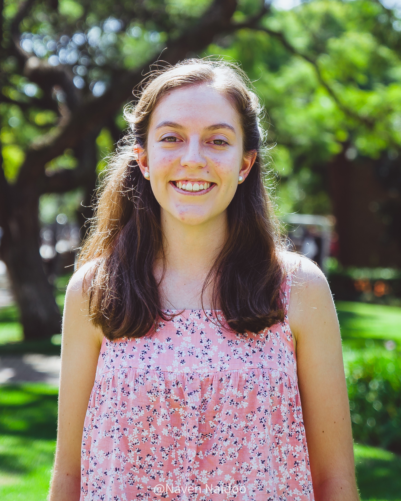

  

  <h1 align="center">Web Exploration Engine </h1>
  <h3 align="center">A Capstone Project for
   <a href="https://www.dns.net.za/">
Domain Name Services (Pty) Ltd.     </a>
  </h3>

https://github.com/user-attachments/assets/b93efbef-643b-4b8d-91b2-d05437615d56

<h3 align="center">The Web Exploration Engine (WEE) automates the extraction of critical website information. Employing cutting-edge scraping technologies and natural language processing, WEE delivers user-friendly insights and reports through an intuitive Progressive Web Application (PWA). With customised scraping capabilities, users can benefit from the power of web scraping for diverse needs, from market research and competitor analysis to lead generation.
</h3>

[Our Website](https://capstone-wee.dns.net.za/) | 
[Summary Slides](https://www.canva.com/design/DAGUGhdECHI/wUZEdPKw-ikbcjl734b35w/edit?utm_content=DAGUGhdECHI&utm_campaign=designshare&utm_medium=link2&utm_source=sharebutton)

  <h1 align="center"> Documentation and Resources </h1>

| Resource                             | Description                                                                                                                         |
|--------------------------------------|-------------------------------------------------------------------------------------------------------------------------------------|
| [Software Requirements Specification](https://drive.google.com/file/d/1MaFtYWnZ2zXstXiF1RS4HlPDrfohCJWV/view?usp=drive_link)     | Details on project requirements            |
| [Architectural Specification](https://drive.google.com/file/d/1cYqBbYG7Q05_HZpL4xxfW74yTd5VWotS/view?usp=drive_link)             | System design overview                     |
| [User Manual](https://drive.google.com/file/d/1joJ745H270WYZFsyDwDsgYrCYzvT7b7z/view?usp=drive_link)                             | Guidelines to using WEE                    |
| [Technical Installation Manual](https://drive.google.com/file/d/1ZDje5oLLxuUHSR7mRGjzmekAQjT3vz9N/view?usp=drive_link)           |  Instructions for system configuration     |
| [Coding Standards](https://drive.google.com/file/d/1ej3eurY4W6VFi7GLRBxFbi3qc6opm3RE/view?usp=drive_link)                        | Guidelines for writing code                |
| [Testing Policy Document](https://drive.google.com/file/d/14GK1PMEEvC90tCRgq2vfsNMf0_90r7yg/view?usp=drive_link)                 | Testing strategies and findings     |
| [Usability Testing](https://drive.google.com/file/d/1mo-rY8wmWe5ZP9KkKDLLTr76pFFs-3pr/view?usp=sharing)                       | Enhance usability and user experience |
| [Contributing](CONTRIBUTING.md)                                                                                               | Guidelines for contributing to WEE         |
| [Architecture Diagram](https://drive.google.com/file/d/18XeSEwOtY41mC4Lcr6jvrzPMW5n9fRTW/view?usp=drive_link)                 | Diagram of system overview                 |
| [Class Diagram](https://drive.google.com/file/d/16yyAfoXCBQyYV_wkpCMy29WbaI8auSaB/view?usp=drive_link)                        | Visual representation of WEE structure     |
| [Deployment Diagram](https://drive.google.com/file/d/113kGo7tnekoP_bN0uDI7ym5CjJaA8XVo/view?usp=drive_link)                   | Plan for project deployment                |
| [Project Board](https://github.com/orgs/COS301-SE-2024/projects/71)                                                           | Team organisation and progress tracking    |
| [Previous Documentation Iterations](https://drive.google.com/drive/folders/1H4omJ2xESlP8_STEu7QdVYtMf1rgsZ-S?usp=sharing)     | See how our documentation has progressed   |

 <h1 align="center"> Demo Resources </h1>

| Demo                        | Video | Slides |
|---------------------------------|---------------------------------|---------------------------------|
| Demo 1 | [Demo 1 Video](https://drive.google.com/file/d/1k34Z3DkhtiaEYbC_AdqoMCpW2_Fb44wW/view?usp=drive_link) | [Demo 1 Slides](https://www.canva.com/design/DAGGIC5EA4E/Sgas9HDvyEG1E8QXFao5xw/edit?utm_content=DAGGIC5EA4E&utm_campaign=designshare&utm_medium=link2&utm_source=sharebutton) |
| Demo 2 | [Demo 2 Video](https://drive.google.com/file/d/1fmjxiQVnpMjOAuttFO75xRElCkPtDDWh/view?usp=sharing) | [Demo 2 Slides](https://www.canva.com/design/DAGHjFa1XEo/w8trIf8dZMyJ7xtJLpWiag/edit?utm_content=DAGHjFa1XEo&utm_campaign=designshare&utm_medium=link2&utm_source=sharebutton) |
| Demo 3 | [Demo 3 Video](https://drive.google.com/file/d/1HYXFZeAeoHbty9NBG3c9h86kCwD3qBhI/view?usp=drive_link) | [Demo 3 Slides](https://www.canva.com/design/DAGM5VQp7f0/MTP7vC8GpmNQX7k_ND45SQ/edit?utm_content=DAGM5VQp7f0&utm_campaign=designshare&utm_medium=link2&utm_source=sharebutton)
| Demo 4 | [Demo 4 Video](https://drive.google.com/file/d/1kIHoI6UXM2WT2x0QEtVY3sPKKny1Wo71/view?usp=drive_linkhttps://www.canva.com/design/DAGRe7Jg-ZE/ZPiYrEXpIPiLauxGehUgkQ/view?utm_content=DAGRe7Jg-ZE&utm_campaign=designshare&utm_medium=link&utm_source=editor) | [Demo 4 Slides](https://www.canva.com/design/DAGRe7Jg-ZE/ZPiYrEXpIPiLauxGehUgkQ/view?utm_content=DAGRe7Jg-ZE&utm_campaign=designshare&utm_medium=link&utm_source=editor)

  <h1 align="center">Technologies </h1>
  

Frontend

  

Backend

    

Project Management & Deployment

   

Testing

    
  

 

<h1 align="center">Meet Tech Odyssey</h1>

  

<table style="border-width: 1px; width: 100%; font-family: Arial, sans-serif; border-collapse: collapse;">
  <tr>
    <td style="vertical-align: top; width:auto; border: 0; padding: 10px;">
  
    </td>
    <td style="vertical-align: top; width: auto; border: 0; padding: 10px;">
      <h2><b style="font-size: 18px;">Johané Breytenbach
</b></h2>
      <h3><b style="font-size: 16px;">Services Engineer, Data Engineer</b></h3> 
      I am a third-year BSc Information and Knowledge System student with a strong focus on Data Science modules and I am well-prepared to contribute significantly to the Web exploration project. My coursework in modules has provided me with a solid foundation in machine learning algorithms and data analysis techniques.
        
      
      
    </td>
  </tr>

 
  <tr>
    <td style="vertical-align: top; width:auto; border: 0; padding: 10px;">
      
    </td>
    <td style="vertical-align: top; width: auto; border: 0; padding: 10px;">
      <h2><b style="font-size: 18px;">Mignon Erasmus</b></h2>
      <h3><b style="font-size: 16px;">UI Engineer, Integration Engineer, DevOps Engineer</b></h3> 
      I am a third year BSc Information and Knowledge Systems student. My degree gives me a strong foundation in Computer Science and Software Development. I am an ambitious, high-achieving and curious individual who always strives for excellence. I find problem solving as an exhilarating experience where one can design and implement unique software solutions that can solve real world problems. I believe that in the ever evolving world of software engineering I am always open to feedback from fellow colleagues and experts to further improve my skills and knowledge. My tenacity ensures that I persist with a problem until I have unravelled it.
        
      
      
    </td>
  </tr>

  <tr>
    <td style="vertical-align: top; width:auto; border: 0; padding: 10px;">
      
    </td>
    <td style="vertical-align: top; width: auto; border: 0; padding: 10px;">
      <h2><b style="font-size: 18px;">Siyamthanda Ndlovu</b></h2>
      <h3><b style="font-size: 16px;">DevOps Engineer, Testing Engineer</b></h3> 
      As a final year computer science student, I am deeply engaged in honing my skills and evolving as a software developer and engineer. Currently, I am enrolled in the Artificial Intelligence (COS 314) module at my university, and I will be taking on the Computer Security and Ethics module (COS 330) in the upcoming semester this year. Over the past 14 months, I have actively participated as a member of various teams, from group projects in my degree modules to my work as a Computer Lab Technician. This experience has given me valuable insights into what it takes to deliver high-quality outcomes and has allowed me to leverage my skills to contribute as much as possible to the teams I am a part of.
        

      
      
    </td>
  </tr>

  <tr>
    <td style="vertical-align: top; width:auto; border: 0; padding: 10px;">
      
    </td>
    <td style="vertical-align: top; width: auto; border: 0; padding: 10px;">
      <h2><b style="font-size: 18px;">Caitlin Simon</b></h2>
      <h3><b style="font-size: 16px;">Project Manager, Integration Engineer, DevOps Engineer, Services Engineer</b></h3> 
     As a computer science student with a passion for data science, I bring valuable skills and a collaborative approach to this project. My experience in data science includes modules, such as Applications in data science (WST 212) and Artificial Intelligence (COS 314) through languages such as C++, Java and R. I gained practical experience through a quantitative science internship, Quantify Your Future where I was able to apply my theoretical knowledge in machine learning and data analytics to real-world problems in the financial sector. 
        
      
      
    </td>
  </tr>

  <tr>
    <td style="vertical-align: top; width:auto; border: 0; padding: 10px;">
      
    </td>
    <td style="vertical-align: top; width: auto; border: 0; padding: 10px;">
      <h2><b style="font-size: 18px;">Katlego Zondo
</b></h2>
      <h3><b style="font-size: 16px;">Services Engineer, Testing Engineer</b></h3> 
      I am a computer science student with a keen interest in software development. My foundation in computer science principles makes me a valuable asset. I have gained practical experience and honed my skills through hands-on projects during my academic journey. I take every situation as an opportunity to learn and grow, leveraging practical experiences in school to enhance my knowledge and expertise. I am driven by the idea of broadening my experiences and developing my abilities further. I view criticism as a constructive tool for improvement and am dedicated to continually challenging myself to reach new standards of performance.
        
      
      
    </td>
  </tr>
</table>
