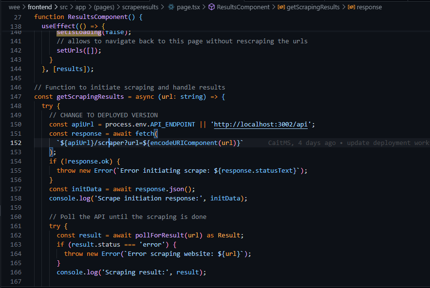

# GET REQUESTS

## Wimpy

**Request**

```bash
https://capstone-wee.dns.net.za/api/scraper?url=https%3A%2F%2Fwimpy.co.za%2F
```

```bash
https://localhost:3002/api/scraper?url=https%3A%2F%2Fwimpy.co.za%2F
```


//https://capstone-wee.dns.net.za/api/scraper?url=https%3A%2F%2Fwimpy.co.za%2F
//{"message":"Scraping task published","status":"processing","pollingUrl":"/status?type=scrape&url=https%3A%2F%2Fwimpy.co.za%2F"}

Where setting results happens :



Note : Mocking for the polling needs to happen